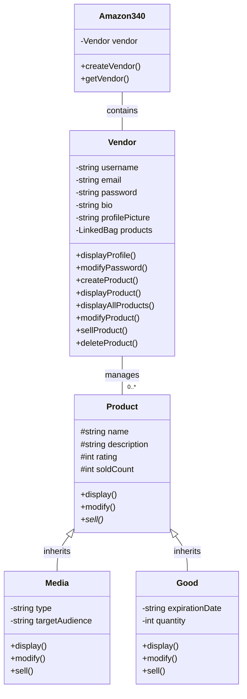

# Amazon340 Codebase Documentation

## Overview

The Amazon340 project implements a simplified e-commerce system that allows vendors to manage their profile and product catalog. The system supports different types of products (Media and Goods) and provides functionality for creating, displaying, modifying, selling, and deleting products.

## Project Structure

The project follows an object-oriented design with the following key components:

- `Amazon340` - Main application class
- `Vendor` - Class representing a seller
- `Product` - Abstract base class for all product types
  - `Media` - Concrete class for media products (books, music, movies)
  - `Good` - Concrete class for physical goods with inventory

The project also uses a custom linked bag data structure for storing collections of products.

## Class Hierarchy

## Detailed Class Documentation

### Amazon340 Class

This is the main application class that serves as the entry point for the program.

#### Attributes
- `vendor`: A Vendor object that represents the seller in the system.

#### Methods
- `Amazon340()`: Constructor that initializes the application.
- `~Amazon340()`: Destructor that cleans up resources.
- `createVendor()`: Creates a new vendor with user-provided information.
- `getVendor()`: Returns the current vendor.

### Vendor Class

This class represents a seller with profile information and a collection of products.

#### Attributes
- `username`: The vendor's username.
- `email`: The vendor's email address.
- `password`: The vendor's password.
- `bio`: The vendor's biographical information.
- `profilePicture`: Path or URL to the vendor's profile picture.
- `products`: A LinkedBag containing pointers to Product objects.

#### Methods
- **Profile Management**
  - `displayProfile()`: Shows the vendor's profile information.
  - `modifyPassword()`: Updates the vendor's password.
  
- **Product Management**
  - `createProduct()`: Adds a new product to the vendor's catalog.
  - `displayProduct()`: Shows details of a specific product.
  - `displayAllProducts()`: Lists all products in the vendor's catalog.
  - `modifyProduct()`: Updates a product's details.
  - `sellProduct()`: Processes a sale for a product.
  - `deleteProduct()`: Removes a product from the catalog.
  
- **Helper Methods**
  - `getKthProduct()`: Retrieves the kth product from the list.
  - `getProductCount()`: Returns the total number of products.

### Product Class (Abstract)

This abstract base class represents a generic product with common attributes and behaviors.

#### Attributes
- `name`: The product name.
- `description`: The product description.
- `rating`: Customer rating (typically 0-5).
- `soldCount`: Number of units sold.

#### Methods
- `display()`: Shows product information.
- `modify()`: Updates product details based on user input.
- `sell()`: Pure virtual method for selling a product (implemented by derived classes).

### Media Class

This concrete class represents media products such as books, music, or movies.

#### Attributes
- Inherits all attributes from Product
- `type`: The type of media (e.g., book, music, movie).
- `targetAudience`: The intended audience for the media.

#### Methods
- `display()`: Shows media product information.
- `modify()`: Updates media product details.
- `sell()`: Implements the selling functionality for media (generates access codes).

### Good Class

This concrete class represents physical goods with inventory and expiration dates.

#### Attributes
- Inherits all attributes from Product
- `expirationDate`: Date when the product expires.
- `quantity`: Available inventory quantity.

#### Methods
- `display()`: Shows goods product information.
- `modify()`: Updates goods product details.
- `sell()`: Implements the selling functionality for goods (reduces inventory).

## Key Functionality

### Vendor Profile Management
- Create vendor profile with username, email, password, bio, and profile picture
- Display vendor profile information
- Update vendor password

### Product Management
- Create new products (either Media or Good)
- Display product details
- Display all products in the catalog
- Modify product details
- Sell products
- Delete products

## Implementation Details

### LinkedBag Data Structure
The project uses a custom LinkedBag data structure for storing products. This is a linked list-based implementation of a bag (a collection that allows duplicates).

### Polymorphism
The system uses polymorphism with the abstract Product class and its derived classes (Media and Good). This allows for type-specific behavior while maintaining a common interface.

### Memory Management
The Vendor class manages dynamically allocated Product objects, ensuring proper cleanup in its destructor to prevent memory leaks.

### User Interface
The program provides a console-based menu system for user interaction, with options for all the supported operations.

## Testing

The project includes test files:
- `input01.txt`: Contains sample inputs for testing the program
- `output01.txt`: Contains the expected outputs for those inputs

The test case exercises the main functionality of the application, including:
1. Creating a vendor profile
2. Creating media and goods products
3. Displaying product information
4. Modifying products
5. Selling products
6. Deleting products

## Design Patterns

### Factory Method (Conceptual)
The program uses a conceptual factory method pattern in the product creation process, where the client code determines which concrete product type to instantiate.

### Composite (Partial)
The Vendor class acts as a composite, managing a collection of Product objects.

## Best Practices

### Documentation
The code is thoroughly documented using C++ documentation comments and follows best practices:
- Class documentation with description of purpose
- Function documentation with @brief, @param, @pre, @post, @return
- Inline comments for member variables

### Input Validation
The program includes input validation to handle invalid user input, preventing crashes and ensuring a better user experience.

### Inheritance and Polymorphism
The project demonstrates proper use of inheritance and polymorphism with the Product class hierarchy.

### Encapsulation
Classes properly encapsulate their data by using private member variables and providing appropriate getter/setter methods.

## Future Enhancements

Potential improvements for the codebase could include:

1. **Persistence**: Add database or file storage to persist data between sessions
2. **User Authentication**: Implement proper user authentication with secure password storage
3. **Additional Product Types**: Extend the product hierarchy with more specific types
4. **Search and Filter**: Add functionality to search and filter products
5. **GUI Interface**: Create a graphical user interface for better user experience
6. **Transaction History**: Implement a system to track and display transaction history
7. **Category Management**: Add support for product categories and tags

## Conclusion

The Amazon340 project demonstrates core object-oriented programming concepts with a clean, well-structured design. The codebase provides a solid foundation that could be extended for more complex e-commerce functionality.